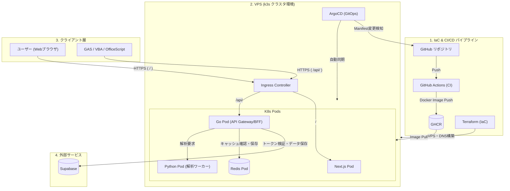
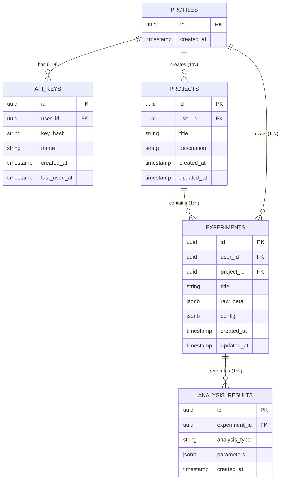

# 実験解析WEBアプリ 設計ドキュメント

## 1. 背景・課題

- 実験データの解析作業が手間（グラフ化、回帰分析など）
- WEBアプリ化して簡単に解析できるようにする

## 2. 要件

### 機能要件

- **プロジェクト単位での実験管理**（1つの実験テーマ＝1プロジェクト。プロジェクトの下に複数の実験データがぶら下がる）
- **他プロジェクトの実験データの呼び出し（コピー）**
- 線形グラフ、片対数グラフ、両対数グラフ
- 非線形グラフ（拡張性を持たせる）
- ログ変換
- 軸ラベルの斜体・立体の区別、日本語・英語・ギリシャ語対応
- 線形回帰などの解析機能
- 複数実験の比較表示（同一グラフへの重ね描画）
- データインポートの容易さ
- 外部API対応（OfficeScript / VBA / GASからの呼び出し）※後回し
- 角度→数値変換などの機能追加の可能性

### 非機能要件

- キャッシュ（Redis等）による軸ラベル変更などの高速反映

## 3. 技術選定（現時点）

- 言語: Go（API Gateway/BFF） + Python（解析ワーカー） + 将来的にC++等（機能追加時）
- DB: Supabase（PostgreSQL / OAuth認証）
- キャッシュ: Redis
- フロント: Next.js
- ホスティング: VPS上のk3s（当初検討はHeroku無料枠等だが、k3s + Terraform + ArgoCDのIaC/GitOps構成に決定）

## 4. アーキテクチャ概要



## 5. データモデル（ER図）



### プロジェクトと実験の関係（方針）

- **1実験は必ず1プロジェクトに所属する（1:N）**。`experiments.project_id`は`NOT NULL`とし、多対多の中間テーブルは持たない（削除時の振る舞い・権限チェック・UIが複雑になるため、必要になるまで作らない）
- `experiments.user_id`は`project_id`から辿れるため冗長だが、**認可チェックを1テーブルで完結させるために残す**（既存の`where id = $1 and user_id = $2`というクエリ形をJOIN無しで維持できる）。アプリ側で常に「実験のuser_id = 所属プロジェクトのuser_id」を保つ
- **他プロジェクトの実験データは「コピー」で取り込む**（参照ではなく複製）。コピー後は完全に独立した実験レコードとなり、元データを編集しても複製先には影響しない。逆も同様
- プロジェクト削除時は配下の実験も`ON DELETE CASCADE`で削除される（実験削除時に`analysis_results`が消えるのと同じ連鎖）

## 6. 描画方針：解析と描画の分離

**方針**：Python Workerは数値解析のみを担当し、グラフ描画は行わない。描画はクライアントごとに異なるパイプラインで行う。

| クライアント | サーバーが返すもの | 描画担当 |
|---|---|---|
| Webフロント（Next.js） | 生データ＋回帰係数などのJSON | フロント側（Plotly.js等） |
| Excel（VBA/OfficeScript） | 生データ＋回帰係数などのJSON | Excel自身のChartオブジェクトAPI |
| （将来）PNGエクスポート | 画像バイナリ | サーバー側（headless描画 or matplotlib） |

解析APIは1本に共通化でき、「誰がどう描くか」だけがクライアントごとに異なる。

### 軸ラベルの中間表現

物理量の軸ラベルは「変数は斜体、単位は立体」「日本語・英語・ギリシャ語混在」という要件があるため、クライアントごとに異なるレンダリング方式が必要。共通の中間表現（ラン配列）を持たせ、クライアントごとに変換する設計とする。

```json
{
  "axis_label_runs": [
    {"text": "v", "italic": true},
    {"text": " (", "italic": false},
    {"text": "m/s", "italic": false},
    {"text": ")", "italic": false}
  ]
}
```

- **Webフロント向け**：数式部分（変数記号・単位）はKaTeXでレンダリング、日本語テキスト部分は通常DOM（CSSで日本語フォント指定）で重ねて配置する。KaTeXは日本語フォントを含まないため、`\text{}`に日本語を混在させず、数式部分とテキスト部分を分離して合成する
- **Excel向け**：ラン配列を`Chart.Axes(...).AxisTitle.TextFrame2.TextRange`のリッチテキスト書式命令に変換し、文字単位で斜体/立体を指定する。ギリシャ文字はUnicode文字（α, θ等）としてそのまま送る

## 7. キャッシュ設計（Redis）

グラフ描画をフロント（クライアント）側で行う方針としたため、キャッシュ対象は**レンダリング結果ではなく解析結果（数値）**とする。

**キー設計**
```
analysis:{experiment_id}:{type}:{params_hash}  → 解析結果JSON
```

**TTL方針**
- 解析結果：実験データが不変なら長め（24h目安）。それ以上はDBに永続化し、Redisは直近アクセス分のみ保持

**プロジェクト導入による影響**
- キーは`experiment_id`起点のままとし、`project_id`はキーに含めない（実験IDは全体で一意で、実験は必ず1プロジェクトにしか属さないため、プロジェクトを足しても一意性は変わらない）
- 実験のコピーは新しい`experiment_id`を発番するため、コピー元のキャッシュを引き継ぐことはなく、無効化も不要
- プロジェクト削除で配下の実験がCASCADE削除された場合、対応するキャッシュキーは孤児として残るがTTLで自然に消える（`raw_data`更新時のような即時無効化は不要。消えた実験IDへのリクエストはDB側で404になり、キャッシュに到達しないため）

## 8. API設計（叩き台）

外部API（GAS/VBA/OfficeScript）対応は後回しとするが、将来の拡張を見据えてレスポンスエンベロープと認証方式の型だけは先に固めておく。

```
GET    /api/v1/projects                          プロジェクト一覧
POST   /api/v1/projects                          プロジェクト作成
GET    /api/v1/projects/{id}                     プロジェクト取得
PATCH  /api/v1/projects/{id}                     プロジェクト更新（タイトル・説明）
DELETE /api/v1/projects/{id}                     プロジェクト削除（配下の実験ごと）

GET    /api/v1/projects/{id}/experiments         プロジェクト配下の実験一覧
POST   /api/v1/projects/{id}/experiments         実験作成（生データ登録）

GET    /api/v1/experiments                       全実験一覧（プロジェクト横断、コピー元の選択用）
GET    /api/v1/experiments/{id}
DELETE /api/v1/experiments/{id}
PATCH  /api/v1/experiments/{id}/config           グラフ設定（軸ラベル等）更新
PATCH  /api/v1/experiments/{id}/raw_data         データ本体の更新
POST   /api/v1/experiments/{id}/copy             他プロジェクトへコピー {project_id}
POST   /api/v1/experiments/{id}/analyze          解析実行 {type: "linear_regression", ...}
POST   /api/v1/convert                           汎用変換（角度→数値など）
```

- **コレクション操作（一覧・作成）はプロジェクト配下のネストしたパス、個々の実験に対する操作は`/experiments/{id}`のフラットなパス**という使い分けにする。実験IDは全体で一意なので、既存の`/experiments/{id}`系のパスは変更せずに済む
- `GET /api/v1/experiments`（プロジェクト横断の全実験一覧）は、コピー元を選ぶUI・複数実験の比較UIのために残す
- レスポンスは統一エンベロープ `{data, error, meta}`
- 認証は将来的に2系統を想定：ブラウザ＝Supabase OAuth JWT、外部＝APIキー（`X-API-Key`）

## 9. 機能拡張の仕組み（角度変換など将来の機能追加）

Go側は「どの言語で書かれたか」を意識せず、ジョブを投げるだけにするプラグイン・レジストリパターンを想定。

- 新機能追加時は、最適な言語で新規ファイル（サービス）を作成し、Go側は`type → 実行先`のマッピングだけ増やす
- 現時点ではPython Workerに解析機能を集約し、必要になったタイミングで別言語に切り出す方針（先に汎用化しすぎない）
- 常駐プロセス化（gRPCサーバー化）を前提にしておくと、都度起動のオーバーヘッドを避けられる

## 10. ログ設計

- 構造化ログ：Go=zerolog/zap、Python=structlog、JSON形式で統一
- トレースID：GoAPIでリクエストごとにUUID発行し、Python Workerまで伝播させてログに含める
- 監査ログ：APIキー発行/失効、データ削除は`audit_logs`テーブルへ別途永続化
- 集約先：Loki+Grafana、あるいは小規模ならファイル+journalctl

## 11. 未決定・今後検討する項目

- 外部API（GAS/VBA/OfficeScript連携）の詳細仕様（後回し）
- エラーレスポンス規約の詳細
- 監視・アラート体制
- PNGエクスポート専用パスの実装方式（headless描画 or matplotlib）